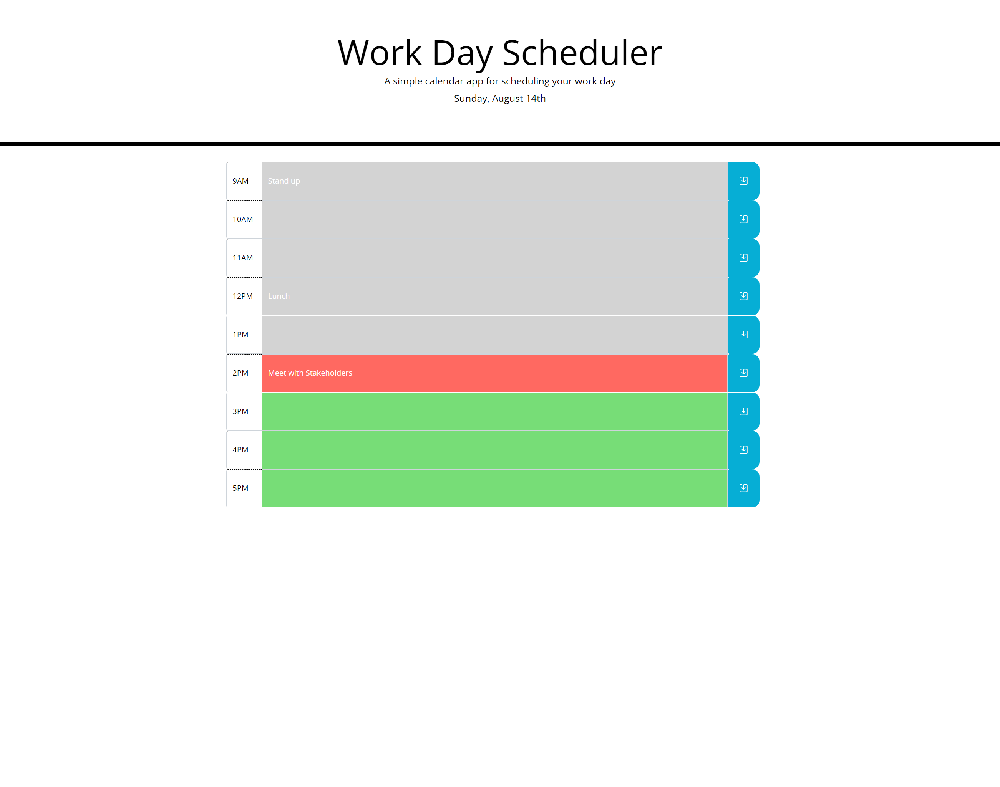

<<<<<<< HEAD
# Work-Day-Scheduler
#### UofU-VIRT-FSF-PT-07-2022-U-LOLC-MWTH Module 5 Code Challenge

## 05 Third-Party APIs: Work Day Scheduler

## Completed Mockup
This is a work day schedule app for tracking 1 hour events through out the business work day. Users can enter and save events for each day. 

Live URL: [https://github.com/icunningham7/Work-Day-Scheduler](https://github.com/icunningham7/Work-Day-Scheduler)

Mockup Preview Image:



## Project Requirements

### User Story

```md
AS AN employee with a busy schedule
I WANT to add important events to a daily planner
SO THAT I can manage my time effectively
```

### Acceptance Criteria

```md
GIVEN I am using a daily planner to create a schedule
WHEN I open the planner
THEN the current day is displayed at the top of the calendar
WHEN I scroll down
THEN I am presented with timeblocks for standard business hours
WHEN I view the timeblocks for that day
THEN each timeblock is color coded to indicate whether it is in the past, present, or future
WHEN I click into a timeblock
THEN I can enter an event
WHEN I click the save button for that timeblock
THEN the text for that event is saved in local storage
WHEN I refresh the page
THEN the saved events persist
```
